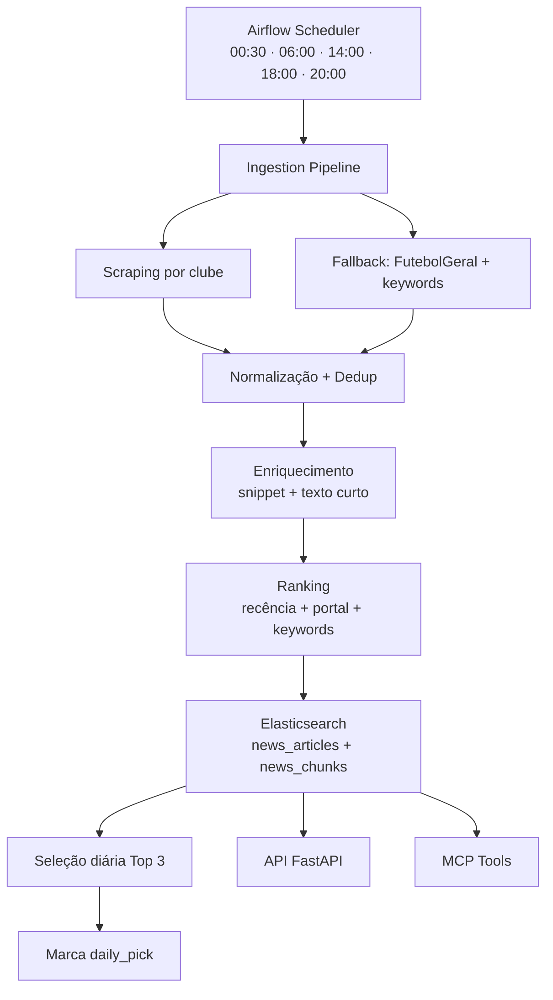
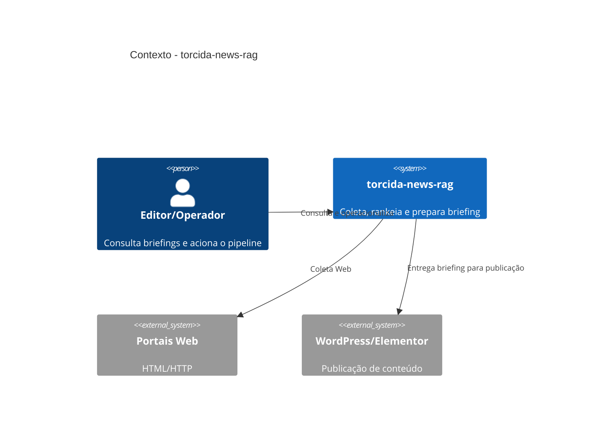
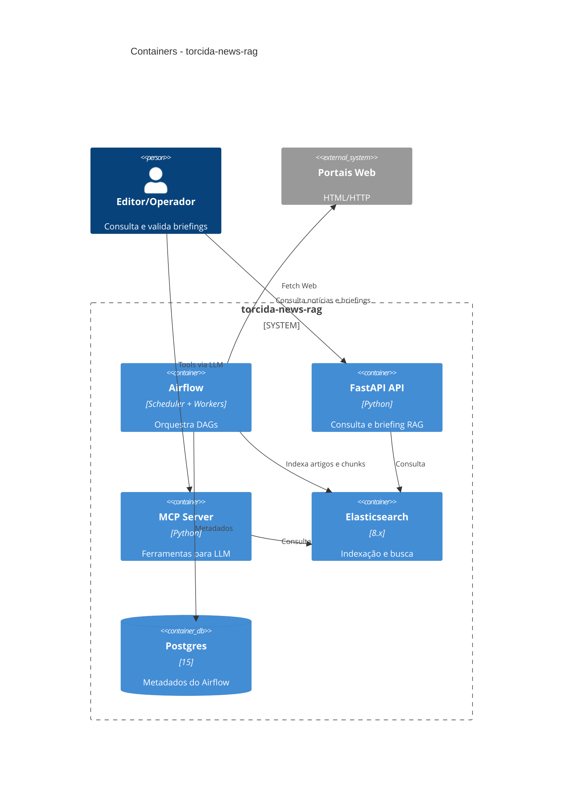
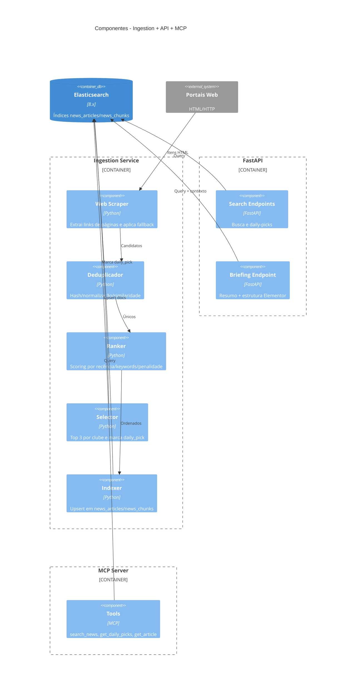

# torcida-news-rag

**torcida-news-rag** é um pipeline scraping-first (HTML) que coleta notícias dos principais clubes brasileiros, deduplica, ranqueia, seleciona as melhores do dia e indexa no Elasticsearch para alimentar uma API de RAG e um servidor MCP.

A ideia é simples e divertida: todo dia o sistema “vira jornalista de plantão”, lê as manchetes mais quentes dos clubes, seleciona o que importa e entrega um briefing pronto para criação de conteúdo (ex.: post no WordPress/Elementor).

---

## Visão geral (técnica, mas com coração)

- **5 coletas diárias** (00:30, 06:00, 14:00, 18:00 e 20:00 America/Fortaleza)
- **Scraping-first**: scraping leve por portal (HTML) com filtro por URL/keywords
- **Fallback inteligente**: se o feed do clube falhar, usa `FutebolGeral` do portal + filtro por keywords
- **Dedup robusto**: URL + título normalizado + similaridade (rapidfuzz >= 92)
- **Ranking**: recência + score do portal + match de keywords + penalidade para opinião/coluna
- **Seleção diária**: top 3 por clube
- **Indexação**: `news_articles` e `news_chunks` (embeddings opcionais)
- **Janela mínima**: ingestão respeita `INGEST_START_DATE`
- **API FastAPI** para consulta e briefing (sem chamar LLM)
- **MCP server** oferecendo ferramentas para LLM

---

## Fluxograma (visão macro)



---

## Diagramas C4 (Context/Container)

### Contexto (C4 Context)


### Containers (C4 Container)


---

### Componentes (C4 Component)


---

## Lógica da aplicação (o “porquê” do pipeline)

### 1) Coleta (scraping-first + fallback)
- Cada portal possui páginas por clube e/ou uma página geral (`FutebolGeral`).
- Se a página do clube falhar, o sistema usa a página geral e **filtra por keywords do clube**.
- O HTML do artigo é baixado **apenas para extrair snippet e texto curto** (limite 6k chars).
- O scraper tenta extrair itens via `application/ld+json` e, se necessário, por `<article>`/links na página.
- Filtros por padrão de URL reduzem ruído por portal (ex.: `/esportes/futebol/` no CNN, `/esporte/futebol/` no UOL).
- Itens anteriores à data configurada em `INGEST_START_DATE` são descartados.

### 2) Deduplicação
Evita repetição “camuflada” de notícias similares:
- **Hash da URL** (`sha1(url)`)
- **Título normalizado**
- **Similaridade** (rapidfuzz >= 92)

### 3) Ranking
O ranking combina frescor + relevância:
- **Recência**: peso configurável e meia-vida (default 36h)
- **Score do portal**: confiabilidade base do veículo
- **Keywords**: cada match aumenta o score
- **Penalidade**: opinião/coluna perde pontos

**Fórmula (simplificada):**
```
score = source_base + recency_weight * recency + keyword_boost * hits - opinion_penalty
```

### 4) Seleção diária (Top 3)
- Para cada clube, pega as 3 notícias mais bem ranqueadas no período.
- Marca como `daily_pick=true` e `daily_pick_date=YYYY-MM-DD`.

---

## Componentes principais

### Airflow
- Orquestra ingestão + seleção diária.
- Executa 5 vezes ao dia.
- DAGs: `torcida_news_ingestion` (06:00, 14:00, 18:00, 20:00) e `torcida_news_ingestion_0030` (00:30).
- Usa TaskGroups por clube.

### Elasticsearch
- **news_articles**: documento completo da notícia (metadata + texto curto)
- **news_chunks**: pedaços do texto para consultas futuras (embeddings opcionais)

### FastAPI (API RAG)
Endpoints:
- `GET /health`
- `GET /clubs`
- `GET /news/search?club=&q=&days=&size=`
- `GET /news/daily-picks?club=&date=`
- `POST /rag/briefing` → gera briefing com resumo + bullets + fontes + estrutura para Elementor

### MCP Server
Ferramentas expostas ao LLM:
- `search_news(club, days, query)`
- `get_daily_picks(club, date)`
- `get_article(url)`
- `health()`

---

## Exemplos de payloads (API e MCP)

### API: `POST /rag/briefing` (request)
```json
{
  "club": "flamengo",
  "days": 3,
  "topic": "mercado da bola",
  "tone": "neutro",
  "wordpress": true
}
```

### API: `POST /rag/briefing` (response)
```json
{
  "resumo": "Panorama flamengo: Chegadas e saídas no elenco; negociações em andamento; entrevista pós-jogo.",
  "bullets": [
    "Flamengo anuncia reforço — Clube confirma contratação para o setor ofensivo.",
    "Negociação avançada — Conversas com atleta estrangeiro seguem em estágio final.",
    "Coletiva pós-jogo — Técnico comenta desempenho e próximos desafios."
  ],
  "fontes": [
    "https://exemplo.com/noticia-1",
    "https://exemplo.com/noticia-2",
    "https://exemplo.com/noticia-3"
  ],
  "draft_structure": {
    "page_title": "Flamengo — Briefing diário",
    "tone": "neutro",
    "sections": [
      {"type": "hero", "title": "Resumo Flamengo", "content": "Panorama flamengo: ..."},
      {"type": "highlights", "title": "Destaques", "items": ["..."]},
      {"type": "sources", "title": "Fontes", "items": ["..."]}
    ]
  }
}
```

### API: `GET /news/search` (response)
```json
[
  {
    "club_id": "flamengo",
    "club_name": "Flamengo",
    "title": "Flamengo anuncia reforço",
    "url": "https://exemplo.com/noticia-1",
    "published_at": "2026-02-26T10:20:00Z",
    "rank_score": 1.72
  }
]
```

### API: `GET /news/daily-picks` (response)
```json
[
  {
    "club_id": "flamengo",
    "title": "Negociação avançada",
    "url": "https://exemplo.com/noticia-2",
    "daily_pick": true,
    "daily_pick_date": "2026-02-26"
  }
]
```

### MCP: tool call (formato genérico)
O formato exato depende do cliente MCP, mas a chamada costuma seguir o padrão `tool + arguments`:

```json
{
  "tool": "search_news",
  "arguments": {
    "club": "flamengo",
    "days": 3,
    "query": "mercado"
  }
}
```

### MCP: response (exemplo)
```json
[
  {
    "club_id": "flamengo",
    "title": "Flamengo anuncia reforço",
    "url": "https://exemplo.com/noticia-1",
    "published_at": "2026-02-26T10:20:00Z"
  }
]
```

### MCP: health
```json
{
  "tool": "health",
  "arguments": {}
}
```

---

## Estrutura dos índices (resumo)

### `news_articles`
Campos principais:
- `club_id`, `club_name`
- `title`, `summary`, `snippet`, `content_text`
- `source_id`, `source_name`
- `published_at`, `ingested_at`
- `rank_score`, `keyword_hits`, `is_opinion`
- `daily_pick`, `daily_pick_date`

### `news_chunks`
Campos principais:
- `article_id`, `chunk_id`
- `club_id`, `club_name`
- `title`, `url`
- `text`
- `embedding` (opcional)

---

## Configuração de clubes e fontes

### Clubs
Arquivo: `services/ingestion/config/clubs.yaml`
- Top 10 já preenchido
- Fortaleza é opcional e pode substituir um clube via `.env`

### Sources
Arquivo: `services/ingestion/config/sources.yaml`
- Páginas HTML por portal (scraping leve)
- Fallback automático para página `FutebolGeral`

### Janela de ingestão
Arquivo: `.env`
- `INGEST_START_DATE`: descarta itens publicados antes dessa data (default `2026-02-27T00:00:00Z`)

### Portais e fontes (Web)
Os portais abaixo são os que a coleta usa hoje, com as respectivas páginas:

**ge.globo (web scraping)**
- Flamengo — https://ge.globo.com/futebol/times/flamengo/
- Corinthians — https://ge.globo.com/futebol/times/corinthians/
- SaoPaulo — https://ge.globo.com/futebol/times/sao-paulo/
- Palmeiras — https://ge.globo.com/futebol/times/palmeiras/
- Santos — https://ge.globo.com/futebol/times/santos/
- Vasco — https://ge.globo.com/futebol/times/vasco-da-gama/
- Cruzeiro — https://ge.globo.com/futebol/times/cruzeiro/
- AtleticoMG — https://ge.globo.com/futebol/times/atletico-mg/
- Bahia — https://ge.globo.com/futebol/times/bahia/
- Gremio — https://ge.globo.com/futebol/times/gremio/
- Fortaleza — https://ge.globo.com/futebol/times/fortaleza/
- FutebolGeral — https://ge.globo.com/futebol/

**Como funciona o scraping do ge.globo**
- O scraper tenta extrair itens via `application/ld+json` e, se necessário, por `<article>`/links na página.
- Se a página do clube não retornar itens, usa `FutebolGeral` com filtro por keywords do clube.
- Limite de itens por página: `INGEST_SCRAPE_MAX_ITEMS` (default 40).
- Se a estrutura do site mudar, ajuste os slugs/URLs em `services/ingestion/config/sources.yaml`.

**UOL Esporte (web)**
- FutebolGeral — https://www.uol.com.br/esporte/futebol/ultimas/
- Flamengo — https://www.uol.com.br/esporte/futebol/times/flamengo/
- Corinthians — https://www.uol.com.br/esporte/futebol/times/corinthians/
- Palmeiras — https://www.uol.com.br/esporte/futebol/times/palmeiras/
- SaoPaulo — https://www.uol.com.br/esporte/futebol/times/sao-paulo/
- Santos — https://www.uol.com.br/esporte/futebol/times/santos/
- Vasco — https://www.uol.com.br/esporte/futebol/times/vasco/
- Gremio — https://www.uol.com.br/esporte/futebol/times/gremio/
- Cruzeiro — https://www.uol.com.br/esporte/futebol/times/cruzeiro/
- AtleticoMG — https://www.uol.com.br/esporte/futebol/times/atletico-mg/
- Bahia — https://www.uol.com.br/esporte/futebol/times/bahia/
- Fortaleza — https://www.uol.com.br/esporte/futebol/times/fortaleza/

**Gazeta Esportiva (web)**
- Flamengo — https://www.gazetaesportiva.com/times/flamengo/
- Corinthians — https://www.gazetaesportiva.com/times/corinthians/
- SaoPaulo — https://www.gazetaesportiva.com/times/sao-paulo/
- Palmeiras — https://www.gazetaesportiva.com/times/palmeiras/
- Santos — https://www.gazetaesportiva.com/times/santos/
- Vasco — https://www.gazetaesportiva.com/times/vasco/
- Gremio — https://www.gazetaesportiva.com/times/gremio/
- Cruzeiro — https://www.gazetaesportiva.com/times/cruzeiro/
- AtleticoMG — https://www.gazetaesportiva.com/times/atletico-mg/
- Bahia — https://www.gazetaesportiva.com/times/bahia/
- Fortaleza — https://www.gazetaesportiva.com/times/fortaleza/
- FutebolGeral — https://www.gazetaesportiva.com/futebol/

**ESPN Brasil (web)**
- FutebolGeral — https://www.espn.com.br/futebol/

**CNN Brasil (web)**
- FutebolGeral — https://www.cnnbrasil.com.br/esportes/futebol/
- Flamengo — https://www.cnnbrasil.com.br/esportes/futebol/flamengo/
- Corinthians — https://www.cnnbrasil.com.br/esportes/futebol/corinthians/
- Palmeiras — https://www.cnnbrasil.com.br/esportes/futebol/palmeiras/
- SaoPaulo — https://www.cnnbrasil.com.br/esportes/futebol/sao-paulo/
- Santos — https://www.cnnbrasil.com.br/esportes/futebol/santos/
- Vasco — https://www.cnnbrasil.com.br/esportes/futebol/vasco/
- Gremio — https://www.cnnbrasil.com.br/esportes/futebol/gremio/
- Cruzeiro — https://www.cnnbrasil.com.br/esportes/futebol/cruzeiro/
- AtleticoMG — https://www.cnnbrasil.com.br/esportes/futebol/atletico-mg/
- Bahia — https://www.cnnbrasil.com.br/esportes/futebol/bahia/
- Fortaleza — https://www.cnnbrasil.com.br/esportes/futebol/fortaleza/

---

## Como subir

1. Copie `.env.example` → `.env`
2. Suba serviços:
   ```bash
   docker compose -f docker-compose.dev-local.yml up -d --build
   ```
3. Acesse:
   - Airflow UI: http://localhost:8080
   - API: http://localhost:8000
   - MCP: http://localhost:7010
   - Elasticsearch: http://localhost:9200
   - Kibana: http://localhost:5601

---

## Acessar Elasticsearch e Kibana (artigos)

### Elasticsearch (direto)
Você pode consultar os índices diretamente via REST:
```bash
curl -s "http://localhost:9200/_cat/indices?v"
curl -s "http://localhost:9200/news_articles/_search?size=3"
```

### Kibana (interface visual)
O Kibana sobe por padrão junto com os outros serviços.

Passos para ver artigos:
1. Acesse http://localhost:5601
2. Vá em **Discover**
3. Crie um **Data View** para `news_articles`
4. Selecione o campo de tempo `published_at`
5. Explore os documentos e filtre por `club_id`

### Kibana: views prontas (script)
Para criar um Data View e Saved Searches por clube e por data:
```bash
python3 scripts/kibana_seed.py
```

---

## Quick test (local)

```bash
curl -s http://localhost:8000/health
curl -s http://localhost:8000/clubs
curl -s "http://localhost:8000/news/search?club=flamengo&days=3&size=3"
curl -s "http://localhost:8000/news/daily-picks?club=flamengo"
curl -s -X POST http://localhost:8000/rag/briefing \
  -H 'Content-Type: application/json' \
  -d '{"club":"flamengo","days":3,"topic":"mercado","tone":"neutro","wordpress":true}'
```

---

## Ajustes importantes

### Substituir um clube por Fortaleza (opcional)
Se quiser manter **apenas 10 clubes**, use no `.env`:
```bash
ENABLE_FORTALEZA=true
FORTALEZA_REPLACE_CLUB_ID=santos
```
Se quiser **todos os clubes habilitados**, mantenha:
```bash
ENABLE_FORTALEZA=true
FORTALEZA_REPLACE_CLUB_ID=
```

---

## Observações legais e boas práticas
- Respeito a rate limits e timeouts configuráveis.
- Conteúdo limitado para evitar riscos de copyright.
- Scraping leve com filtros por URL/keywords (apenas snippet + texto curto).

---

## Roadmap (ideias futuras)
- Melhorias de seletor/precisão por portal (opt-in)
- Embeddings + reranking
- Cache por portal
- Avaliação automática de qualidade de fontes

---

## Checklist rápido
- [ ] `docker compose up` sobe todos os serviços
- [ ] `GET /health` retorna `status=ok`
- [ ] DAGs `torcida_news_ingestion` e `torcida_news_ingestion_0030` aparecem no Airflow
- [ ] Índices `news_articles` e `news_chunks` criados

---

## Glossário rápido
- **Scraping-first**: prioriza páginas HTML e aplica filtros por portal/keywords
- **RAG**: retrieval-augmented generation (aqui só preparamos contexto)
- **MCP**: Model Context Protocol, para expor ferramentas ao LLM

---
